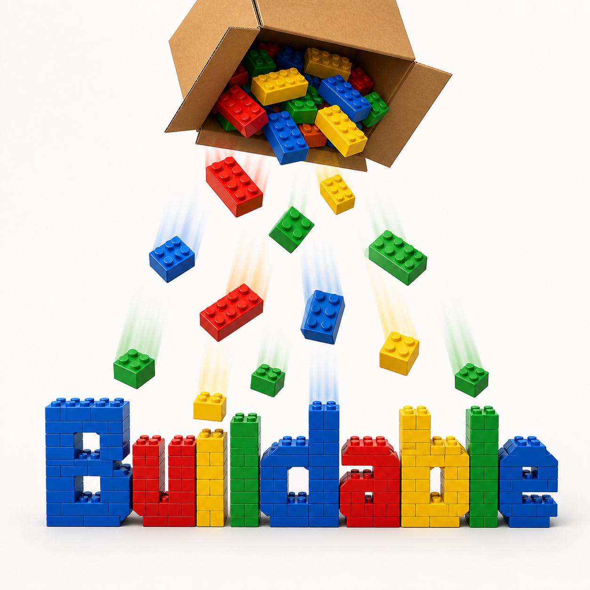

<div align="center">
  
</div>

<h1 align="center">Buildable</h1>

<p align="center">
  <a href="https://github.com/cpieper/buildable/actions/workflows/ci.yml"></a>
  <a href="LICENSE"></a>
  <a href="backend/pyproject.toml"></a>
  <a href="frontend/package.json"></a>
  <a href="frontend/package.json"></a>
</p>

Buildable is a local-first LEGO collection and buildability app. It combines the pieces in your owned official sets, accounts for known missing pieces, and explains which cached sets you can build—including color swaps.

## Development on macOS

Install Python 3.11+, [uv](https://docs.astral.sh/uv/), Node.js 22+, and npm. Then install dependencies and run the two local servers:

```bash
cd backend && uv sync
cd ../frontend && npm ci
cd ..
make dev
```

The frontend is at `http://localhost:5173`; the API is at `http://localhost:8000`. Run the checks with:

```bash
make test
make check
```

## Catalog setup

Set `BUILDABLE_REBRICKABLE_API_KEY` in a local `.env` to enable targeted Rebrickable lookups. With a key configured, use **Settings** to import a discovery CSV exported from a Rebrickable set list; Buildable will fetch those set inventories into the catalog without adding them to your collection. For broad offline coverage, import a Rebrickable ZIP containing the catalog CSV files for sets, parts, colors, and set inventory. Settings also supports manual set entry for small catalogs or corrections.

Catalog data is the pool of possible build targets, not your owned collection. For discovery, start with exact builds and color swaps, then include missing-piece matches to find near misses that may only need a small parts order.

## Raspberry Pi / Debian deployment

Use 64-bit Raspberry Pi OS or Debian 12+ with Docker Engine and the Docker Compose plugin installed. Copy the sample environment file and replace both secret values before starting:

```bash
cp .env.example .env
mkdir -p data
docker compose up --build -d
docker compose logs -f app
```

The app listens on `http://<pi-lan-ip>:8000` by default; change `BUILDABLE_PORT` in `.env` if required. The account that runs Docker must be able to read and write `./data`; it holds the SQLite database and backups. `BUILDABLE_INITIAL_PASSWORD` is used only when no password hash exists, so remove it from `.env` after the first successful boot if desired. Set `BUILDABLE_SECURE_COOKIES=true` when the LAN service is protected by HTTPS.

To upgrade while preserving data:

```bash
docker compose build
docker compose up -d
```

## Passwords and backup recovery

Reset a forgotten shared password without exposing it in shell history or process arguments:

```bash
./scripts/reset-password.sh
```

Create an additional JSON backup with:

```bash
docker compose exec app buildable export-backup /data/backups/manual.json
```

Back up the complete `data/` directory before upgrades. Full recovery is: stop the service, restore `data/`, then start Compose again. A JSON backup contains personal collection data and local rules, not the catalog cache or secrets. For JSON-only recovery, first import the catalog again in Settings, then restore the personal-data backup from Settings.

Future ideas and intentionally deferred features are listed in [Future Work](docs/product/future-features.md).
