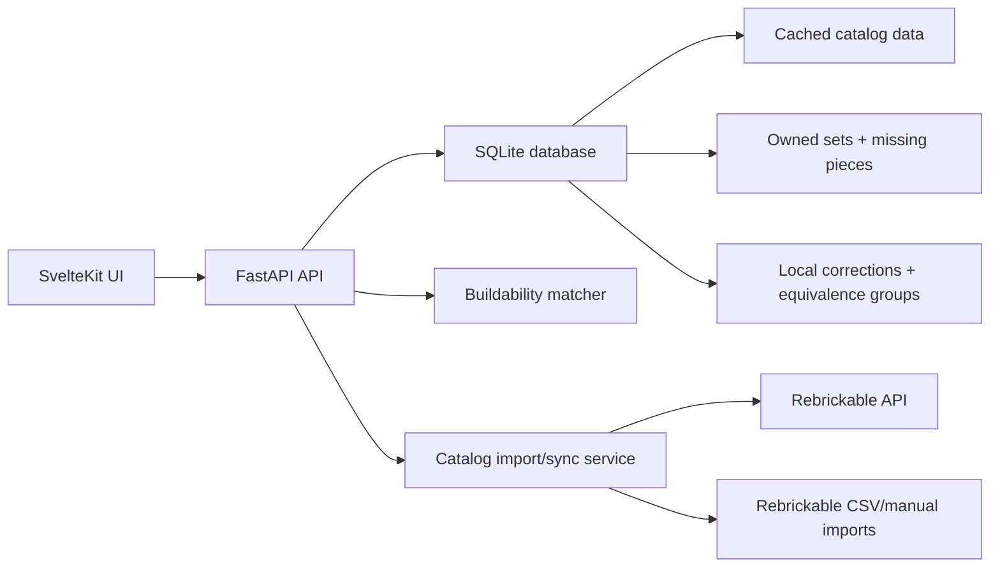

# LEGO Inventory And Buildability App Design

## Context

This repository is currently a blank slate: no tracked application files and no existing commits. The first version can therefore choose a stack and architecture around the product needs rather than adapting to an existing codebase.

The application is a lightweight local-first web app for logging owned official LEGO sets, computing the combined available piece inventory, and showing which additional official LEGO sets can be built from those pieces. Color mismatches are highlighted, but they do not block buildability when the same part is available in another color. The v1 product is intended to run on macOS during development and on a Raspberry Pi as a LAN web app.

## Goals

- Log owned official LEGO sets with quantity, completeness status, known missing pieces, unknown missing notes, and freeform notes.
- Build a combined available inventory from owned set inventories minus known missing pieces.
- Search for an official LEGO set and evaluate whether it can be built from the available inventory.
- Browse recommendations from cached official LEGO sets.
- Classify build targets as exact buildable, color-substitution buildable, or missing pieces.
- Highlight color substitutions as a fun, inspectable part of the result rather than as a hard failure.
- Support explicit non-color part equivalence groups for curated substitutions.
- Keep imported catalog data separate from local collection data and local corrections.
- Support optional Rebrickable API lookup plus CSV/manual import fallback.
- Run as a small LAN web app protected by a single shared password.
- Export/import a JSON backup of personal collection data, local corrections, equivalence groups, and non-secret settings metadata.

## Non-Goals For V1

- Multi-set build planning, carts, piece reservations, or conflict resolution across multiple candidate builds.
- Loose individual piece inventory.
- Storage locations, tags, loan tracking, or display status.
- Build history or currently-built/reserved sets.
- Camera scanner, barcode scanner, QR scanner, or part recognition.
- MOCs, alternate builds, or unofficial build targets.
- Hosted multi-user accounts.
- Scheduled background catalog sync.
- Instruction PDF storage or instruction-step management.

## Recommended Approach

Use a local catalog cache plus an app-owned matcher.

FastAPI owns SQLite, catalog import/sync, local correction layers, collection operations, backup/restore, authentication, and buildability matching. SvelteKit owns the browser UI. The app stores cached catalog data separately from owned collection data and local overrides. Matching runs locally so the app can support color-insensitive matching, explicit equivalence groups, explainable mismatch details, and offline use against cached data.

Rejected alternatives:

- Thin app over Rebrickable: faster conceptually, but weaker for local correction layers, offline use, and the app's custom color-substitution semantics.
- Import-first offline-only tool: robust and private, but less convenient for adding sets by number/name.

## Architecture

Core boundaries:

- SvelteKit frontend: collection management, recommendation browsing, build target search, match detail views, inventory tables, settings, backup/import UI, and mobile-responsive layouts.
- FastAPI backend: single-password authentication, API routes, Rebrickable/CSV import, matching, local correction application, backup export/import, and lightweight sync status.
- SQLite: durable local storage on disk for Raspberry Pi deployment.
- Catalog cache: imported official LEGO set, part, color, and set inventory metadata.
- Collection layer: owned sets, quantities, incomplete status, known missing pieces, unknown missing notes, and user notes.
- Correction layer: local overrides and explicit part equivalence groups layered over immutable imported catalog records.
- Matcher: computes exact buildable, color-substitution buildable, or missing pieces for one target at a time.

Rebrickable integration is optional. API keys are stored only in local environment/config and are never committed. CSV/manual imports remain available without an API key. Rebrickable's API documentation covers set, part, color, and inventory endpoints, and its docs recommend downloads for bulk catalog lists because API calls are throttled. The app should therefore avoid API-heavy crawling and favor targeted lookup plus CSV/import-based catalog population.

Source: [Rebrickable API documentation](https://rebrickable.com/api/v3/docs/?key=xxxxxxxxxx).

## Data Model

Primary entities:

- CatalogSet: set number, name, year, theme, official piece count, image URLs, external links, and last synced metadata.
- CatalogPart: Rebrickable part number, name, category, image URL, and external IDs when available.
- CatalogColor: Rebrickable color ID, name, RGB hex, and external color IDs when available.
- CatalogSetPart: set number, part number, color ID, quantity, spare flag, and optional minifig/source flags if exposed by imports.
- OwnedSet: catalog set number, quantity owned, completeness status, unknown missing count/note, user notes, and added date.
- OwnedSetMissingPart: owned set reference, part number, color ID, quantity, and optional note.
- LocalCatalogOverride: explicit local corrections to set metadata or inventory rows without mutating imported catalog records.
- PartEquivalenceGroup: explicit groups of part numbers that can substitute for each other beyond color.
- AppSetting: password hash/config metadata, Rebrickable key presence/config, sync metadata, and backup metadata as needed. Secrets such as the Rebrickable API key and password hash are not included in JSON exports.

Inventory is computed, not manually maintained. Owned set inventories are expanded from effective catalog rows, multiplied by owned quantity, and reduced by known missing pieces. Intact owned sets can contribute catalog rows marked as spare pieces to the available inventory. Unknown missing counts and notes appear as confidence warnings but do not change inventory math.

The matcher accepts an inventory snapshot. V1 always passes the full available inventory, but this interface keeps future build planning possible without changing the matcher contract.

## Matching Logic

The matcher evaluates one build target at a time against the computed available inventory.

Build target requirements exclude catalog rows marked as spare pieces. Minifig and accessory inventory rows are included as normal pieces when the catalog identifies them as part of the official set inventory.

For each required part row in the target set:

1. Satisfy as much quantity as possible with the exact same part number and color.
2. If exact color is short, satisfy remaining quantity with the same part number in any color.
3. If still short, use explicit equivalent part numbers from local equivalence groups, first exact color and then any color.
4. Anything still unsatisfied is a true missing requirement.

Available pieces are consumed during evaluation, so one available piece cannot satisfy two requirements inside the same candidate set.

Result statuses:

- Exact buildable: every required piece is satisfied by exact part/color matches.
- Color-substitution buildable: every required piece is satisfied, but at least one piece uses a different color or an explicit equivalent part.
- Missing pieces: one or more required pieces cannot be satisfied after allowed substitutions.

Result details include exact match count, color substitution count, equivalence substitution count, true missing count, percent exact by quantity, percent buildable by quantity, color mismatch breakdown by required part/color, missing pieces list, and optional source summary where useful.

V1 does not reserve pieces after viewing or building a recommendation.

## Core User Flows

- Unlock app: a single shared password protects the LAN app. There are no user accounts or roles.
- Add owned set: search by set number/name. If the set is not cached, use Rebrickable API when configured; otherwise guide the user to import CSV/manual data first. Add quantity, completeness status, and notes.
- Record missing pieces: browse/search the expected inventory for an owned set and mark specific missing part/color/quantity. Optional unknown missing counts/notes act as confidence warnings.
- View combined inventory: group by part, expand by color, show thumbnails and color swatches, and surface confidence warnings from incomplete sets.
- Search build target: type set number/name, fetch/cache if needed, then show buildability for that one official set.
- Browse recommendations: evaluate cached official sets filtered by default to piece count less than or equal to total available pieces, official sets only, and hide already-owned sets. Default sort is exact buildable first, then color-substitution buildable, then fewest missing pieces. User-controlled sorts/filters can include piece count, year, theme, mismatch count, and missing count.
- Inspect recommendation: show set image, metadata, external/instruction links, status, exact/substitution/missing counts, color mismatch highlights, missing pieces, and optional piece-source hints.
- Catalog refresh/import: manually trigger targeted API lookup or CSV/manual import. Scheduled refresh is future work.
- Backup/restore: export/import JSON containing owned collection, missing pieces, local overrides, equivalence groups, and non-secret settings metadata. Cached catalog data can be rebuilt and does not need to be the primary backup payload.

## UI Direction

The app uses Workshop Rail as the base visual direction:

- Compact left rail for Collection, Inventory, Buildable Sets, and Settings.
- Dense recommendation list/grid optimized for scanning.
- Tactile details such as color swatches, small stud-like status indicators, restrained LEGO-inspired color, and a workshop/catalog feeling.
- Builder's Bench detail mode for individual set matches, including match bars, the color-substitution story, missing pieces, and source hints.
- Inventory Ledger dense table mode for inventory browsing and matcher explainability.
- Mobile-responsive layouts that stack content and use compact navigation while preserving the same information.

The app should avoid generic glossy dashboard patterns. It should feel like a practical personal workshop catalog: clear, slightly playful, but still efficient for repeated use.

Future scanner support should fit as a quick-add action in Collection/Search, but no camera workflow ships in v1.

## Error Handling And Trust

- Missing API key: app still works with cached/imported data. Lookup screens explain that Rebrickable lookup requires a local key or CSV/manual import.
- API throttling or network failure: show non-blocking sync errors with retry guidance. Existing cache remains untouched unless a sync transaction completes successfully.
- Catalog gaps: allow manual import or local override. Mark build targets with incomplete catalog metadata where relevant.
- Unknown missing pieces: show confidence warnings on owned sets and inventory summaries. Only known missing pieces affect calculations.
- Local overrides: keep imported catalog records immutable. Apply overrides as a visible local correction layer.
- Backup import conflicts: validate backup version/schema before import. V1 restore should require an intentional replace/merge decision. The recommended default is to export a safety backup, then replace local collection data and local rules while letting catalog cache be rebuilt.
- Password loss: document a server-side reset command or environment procedure rather than building account recovery UI.
- Matcher explainability: every result should expose enough detail to answer why a set received its status.

Settings should show last successful sync/import, recent sync failure state, API key configured status, backup/export actions, password change, and equivalence group management.

## Testing Strategy

- Matcher unit tests: exact buildable, color-substitution buildable, equivalent-part substitution, true missing pieces, duplicate consumption, quantity handling, spare handling, and unknown missing notes not affecting math.
- Inventory computation tests: owned set quantity expansion, known missing subtraction, multiple owned copies, incomplete set warnings, and local override layering.
- Import tests: Rebrickable CSV parsing, targeted API import mapping, malformed import rejection, duplicate catalog rows, and color/part identity preservation.
- Backup tests: export/import round trip, schema version validation, and conflict behavior.
- API tests: auth required, collection CRUD, missing-piece CRUD, recommendation filters/sorts, and build target detail.
- Frontend smoke tests: unlock, add owned set, mark missing pieces, browse recommendations, inspect mismatch detail, and export backup.

## Acceptance Criteria

- User can unlock the local LAN app with a single shared password.
- User can log owned official LEGO sets with quantity, incomplete status, known missing pieces, unknown missing notes, and notes.
- App computes combined available inventory from owned set inventories minus known missing pieces.
- User can search and evaluate one official LEGO set at a time.
- Recommendations classify cached official sets as exact buildable, color-substitution buildable, or missing pieces.
- Color substitutions count as buildable and are clearly highlighted.
- Explicit equivalence groups can allow curated non-color substitutions.
- App can use optional Rebrickable API lookup and CSV/manual import fallback.
- App runs locally on macOS for development and can be deployed to a Raspberry Pi on a LAN.
- JSON backup/export and restore exist for collection data, local corrections, equivalence groups, and non-secret settings metadata.

## Future Work

- Multi-set build planning with a build cart, piece reservations, and conflict resolution.
- Loose individual piece inventory.
- Storage locations, bins, tags, display status, and loan tracking.
- Build history and currently-built set reservations.
- Camera, barcode, or QR scanning for quick set entry.
- Computer vision part recognition if it becomes accurate enough to be worth the workflow cost.
- MOCs, alternate builds, and unofficial build targets.
- Scheduled background catalog refresh on the Raspberry Pi.
- Richer substitution rules beyond explicit equivalence groups.
- Instruction PDF storage, instruction-step links, or build-session helpers.
- Household/multi-user collections if the LAN app grows beyond one shared collection.
